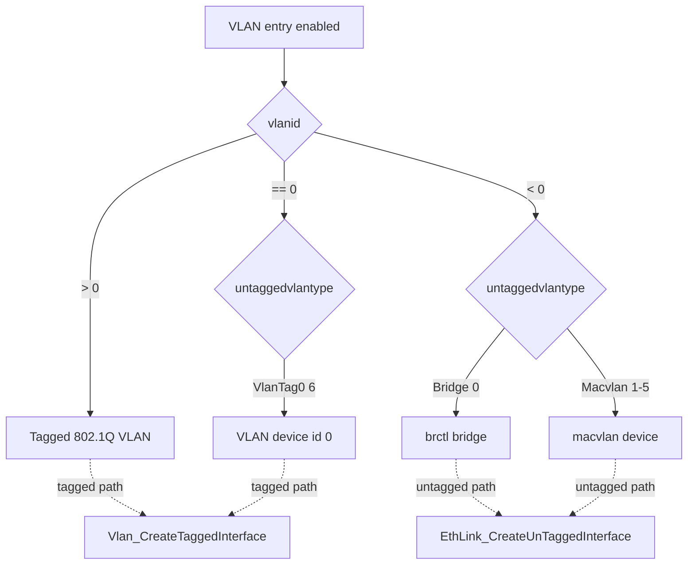

# VlanManager Configuration Guide

This document describes how to configure VlanManager VLAN termination entries
through PSM, when to choose each VLAN / MACVLAN type, and how the
`UntaggedVlanType` data-model parameter maps to the underlying Linux netdev.

- [1. PSM configuration](#1-psm-configuration)
  - [1.1 Per-entry PSM keys](#11-per-entry-psm-keys)
  - [1.2 Country / region PSM (HUB4 only)](#12-country--region-psm-hub4-only)
  - [1.3 Example](#13-example)
- [2. Interface type selection](#2-interface-type-selection)
  - [2.1 The `UntaggedVlanType` parameter](#21-the-untaggedvlantype-parameter)
  - [2.2 Decision guide](#22-decision-guide)
- [3. Data model parameters](#3-data-model-parameters)

---

## 1. PSM configuration

VlanManager loads all VLAN termination entries from PSM at start-up
(`VlanTerminationInitialize()` in `vlan_internal.c`). Each entry describes one
virtual interface layered on top of an Ethernet base interface.

### 1.1 Per-entry PSM keys

All keys are indexed by the 1-based instance number `%d`.

| PSM key | Type | Description |
|---------|------|-------------|
| `dmsb.vlanmanager.ifcount` | int | Total number of VLAN termination entries |
| `dmsb.vlanmanager.%d.VlanEnable` | `TRUE`/`FALSE` | Enable the entry at boot |
| `dmsb.vlanmanager.%d.alias` | string | Alias / label (e.g. `DATA`, `VOICE`); also the parent ethlink name |
| `dmsb.vlanmanager.%d.name` | string | Resulting interface name (e.g. `erouter0`, `nett\|brwan`) |
| `dmsb.vlanmanager.%d.lowerlayers` | string | TR-181 path to the parent EthLink (`Device.X_RDK_Ethernet.Link.%d`) |
| `dmsb.vlanmanager.%d.vlanid` | int | 802.1Q VLAN id. `> 0` = tagged, `0` = tag-0, `< 0` = untagged |
| `dmsb.vlanmanager.%d.tpid` | uint | Tag protocol id (0x8100 / 0x88a8) |
| `dmsb.vlanmanager.%d.untaggedvlantype` | uint | **New.** Selects how an untagged (`vlanid <= 0`) interface is realised. See [§2](#2-interface-type-selection). |
| `dmsb.vlanmanager.%d.baseinterface` | string | Physical base interface (e.g. `eth0`, `dsl0`) |
| `dmsb.vlanmanager.%d.path` | string | TR-181 path used to report VlanStatus back to WanManager |

> `untaggedvlantype` is only consulted for **untagged** entries. For tagged
> entries (`vlanid > 0`) it is forced to `Tagged(7)` at load time and never
> read at interface-creation time.

### 1.2 Country / region PSM (HUB4 only)

On builds compiled with `_HUB4_PRODUCT_REQ_`, a second, region-indexed PSM
table selects the VLAN id / TPID per router region:

| PSM key | Description |
|---------|-------------|
| `dmsb.vlanmanager.cfg.count` | Number of regional config rows |
| `dmsb.vlanmanager.cfg.%d.region` | Region string matched against `platform_hal_GetRouterRegion()` |
| `dmsb.vlanmanager.cfg.%d.vlanid` | VLAN id for that region |
| `dmsb.vlanmanager.cfg.%d.tpid` | TPID for that region |

> **Deprecation note.** This country/region `dmsb.vlanmanager.cfg.*` table is a
> stop-gap that hard-codes the VLAN id per country in PSM. It **can and should
> be removed** once the WAN VLAN is determined dynamically — i.e. after moving
> to *VLAN discovery* (auto-detect the operator VLAN on the link) or to a
> *boot-time configuration* source (cloud/ACS/JSON). At that point VlanManager
> should receive the resolved `vlanid`/`tpid` directly on the per-entry keys and
> the regional `cfg` branch in `VlanTerminationInitialize()` can be deleted.
>
> `untaggedvlantype` is intentionally **not** loaded from the `cfg` table: the
> HUB4 regional flow always uses `UNTAGGED_SIMPLE_BRIDGE` (brctl) for untagged
> VLANs.

### 1.3 Example

A single tagged DATA VLAN (id 100) on `eth0`:

```
psmcli set dmsb.vlanmanager.ifcount 1
psmcli set dmsb.vlanmanager.1.VlanEnable TRUE
psmcli set dmsb.vlanmanager.1.alias DATA
psmcli set dmsb.vlanmanager.1.name nettXvlan
psmcli set dmsb.vlanmanager.1.lowerlayers Device.X_RDK_Ethernet.Link.1
psmcli set dmsb.vlanmanager.1.vlanid 100
psmcli set dmsb.vlanmanager.1.tpid 33024
psmcli set dmsb.vlanmanager.1.baseinterface eth0
```

An untagged WAN over a Linux bridge (default type):

```
psmcli set dmsb.vlanmanager.1.vlanid -1
psmcli set dmsb.vlanmanager.1.untaggedvlantype 6    # UNTAGGED_SIMPLE_BRIDGE
psmcli set dmsb.vlanmanager.1.baseinterface eth0
```

---

## 2. Interface type selection

The `vlanid` value picks the **class** of interface; `untaggedvlantype` refines
the untagged class:



### 2.1 The `UntaggedVlanType` parameter

| Value | Name | Realisation | Kernel command |
|-------|------|-------------|----------------|
| 0 | `MacvlanPrivate` (default) | macvlan, endpoints isolated | `ip link add … type macvlan mode private` |
| 1 | `MacvlanVepa` | macvlan, hairpin via external switch | `… mode vepa` |
| 2 | `MacvlanBridge` | macvlan, local forwarding between endpoints | `… mode bridge` |
| 3 | `MacvlanPassthru` | macvlan, single endpoint owns the lower dev | `… mode passthru` |
| 4 | `MacvlanSource` | macvlan, source-MAC filtered | `… mode source` |
| 5 | `VlanTag0` | 802.1Q VLAN with tag id 0 (priority-tagged) | `ip link add … type vlan id 0` |
| 6 | `Bridge` | Linux bridge, base iface enslaved | `brctl addbr` / `addif` |
| 7 | `Tagged` | conventional tagged VLAN (display only) | set automatically when `vlanid > 0` |

The MACVLAN modes map 1:1 to the kernel `ip-link(8)` macvlan modes.

### 2.2 Decision guide

| Use case | Recommended type |
|----------|------------------|
| Operator delivers WAN on a **tagged** VLAN | tagged (`vlanid > 0`) |
| Priority-tagged frames (VID 0, PCP set) with QoS | `VlanTag0 (5)` |
| Plain untagged WAN, want a bridge you can add more ports to later | `Bridge (6)` |
| Untagged WAN needing its **own MAC** distinct from the base iface, isolated | `MacvlanPrivate (0)` — default |
| Multiple virtual endpoints that must talk to each other locally | `MacvlanBridge (2)` |
| Deployment behind a VEPA-capable switch (hairpin) | `MacvlanVepa (1)` |
| One endpoint that must fully own the base iface (e.g. move its MAC) | `MacvlanPassthru (3)` |
| Restrict to a fixed allow-list of source MACs | `MacvlanSource (4)` |

Notes:
- Only **tagged** and **VlanTag0** interfaces support 802.1p `egress-qos-map`;
  bridge and macvlan types cannot carry per-priority PCP marking (see the
  sequence-diagram doc, *Markings*).
- `Bridge (6)` inherits the base interface MAC automatically (kernel sets the
  bridge MAC to the lowest enslaved MAC). The macvlan types honour the EthLink
  `MACAddrOffSet` to derive a distinct MAC.

---

## 3. Data model parameters

`Device.Ethernet.VLANTermination.{i}.` exposes, among others:

| Parameter | Type | Access | Backed by |
|-----------|------|--------|-----------|
| `VLANID` | int | RW | `dmsb.vlanmanager.%d.vlanid` |
| `TPID` | uint | RW | `dmsb.vlanmanager.%d.tpid` |
| `UntaggedVlanType` | uint (mapped) | **RO** | `dmsb.vlanmanager.%d.untaggedvlantype` |
| `X_RDK_BaseInterface` | string | RW | `dmsb.vlanmanager.%d.baseinterface` |

`UntaggedVlanType` is a **read-only, mapped** enum. It is populated from PSM at
init and is not writable from the data model — change it via PSM and restart, or
via boot-time config once available.

Mapped string values:
`MacvlanPrivate(0),MacvlanVepa(1),MacvlanBridge(2),MacvlanPassthru(3),MacvlanSource(4),VlanTag0(5),Bridge(6),Tagged(7)`
