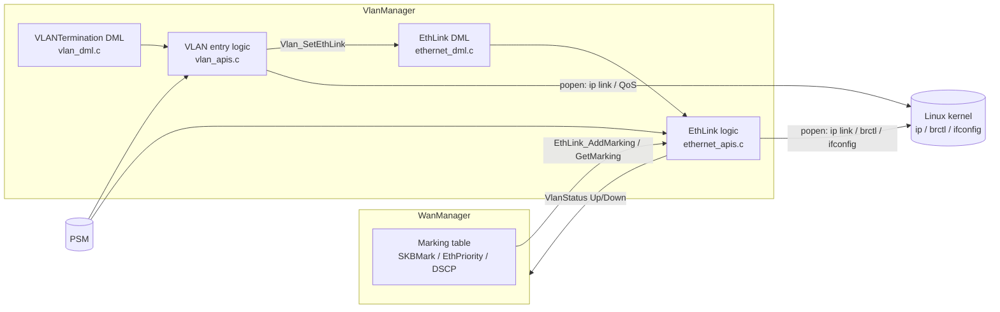
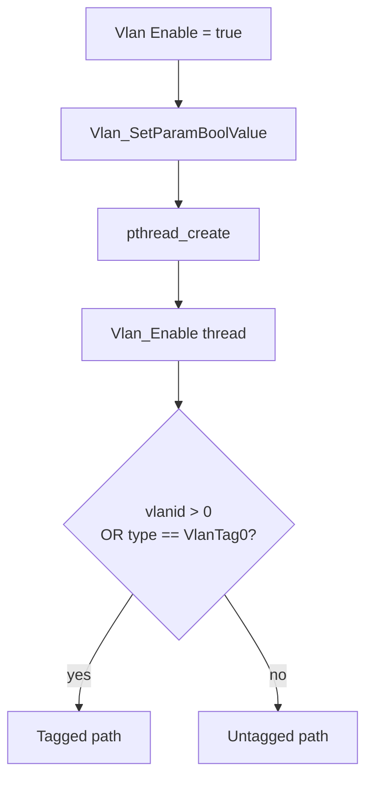
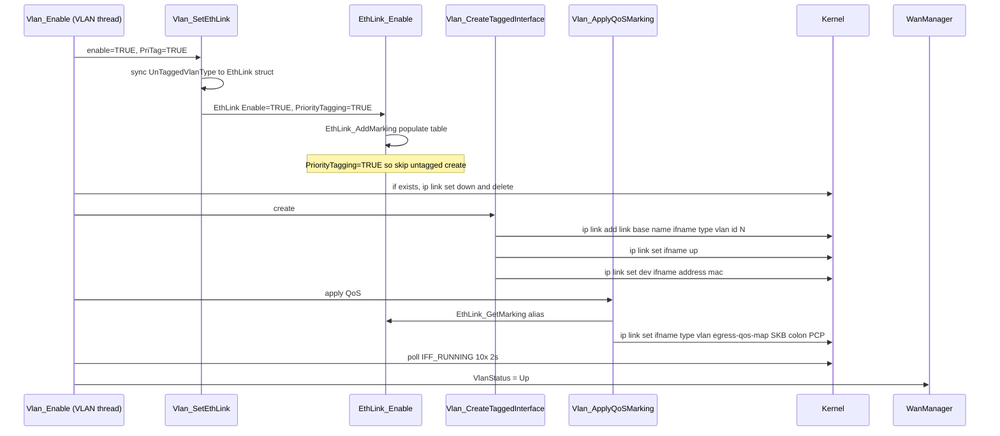
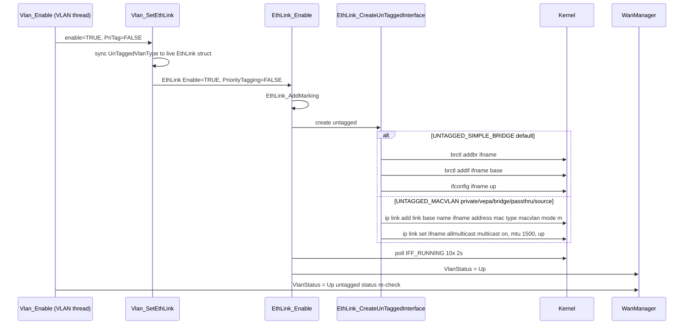
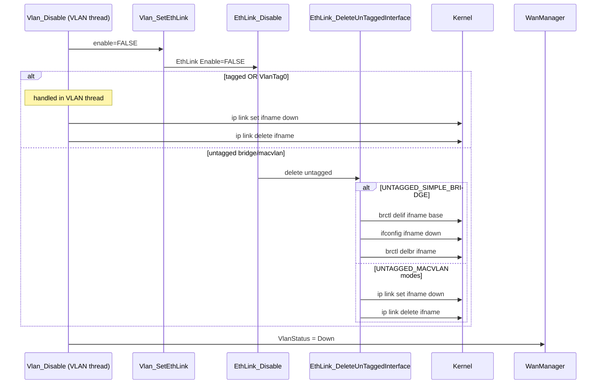
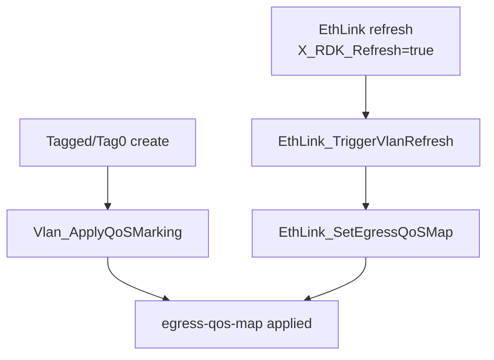

# VlanManager Components & Sequence Diagrams

This document describes the runtime components of VlanManager and the
create / delete / marking sequences for tagged and untagged VLAN interfaces.

- [1. Components](#1-components)
- [2. Trigger & threading model](#2-trigger--threading-model)
- [3. Tagged VLAN create (incl. VLAN tag-0)](#3-tagged-vlan-create-incl-vlan-tag-0)
- [4. Untagged VLAN create (bridge / macvlan)](#4-untagged-vlan-create-bridge--macvlan)
- [5. Delete sequences](#5-delete-sequences)
- [6. Markings (QoS)](#6-markings-qos)

---

## 1. Components



| Component | File | Responsibility |
|-----------|------|----------------|
| VLANTermination DML | `vlan_dml.c` | TR-181 get/set, spawns worker threads on Enable |
| VLAN entry logic | `vlan_apis.c` | Tagged create/delete, QoS apply, status poll |
| EthLink DML | `ethernet_dml.c` | TR-181 get/set for `Device.X_RDK_Ethernet.Link` |
| EthLink logic | `ethernet_apis.c` | Untagged create/delete, marking table, VlanStatus |
| Command runner | `ethernet_apis.c` `EthLink_RunCmd` / `EXEC_CMD` | `popen()` wrapper that logs the command + all stdout/stderr and the exit code |

**Key architectural point:** the *config* (type, vlanid) lives on the **VLAN
entry**, but untagged interface *creation* happens in the **EthLink** object.
`Vlan_SetEthLink()` bridges the two — `EthLink_GetEntry()` returns the live
`DML_ETHERNET` struct, so the VLAN thread writes `UnTaggedVlanType` directly onto
it before committing.

---

## 2. Trigger & threading model

Enabling an entry (from PSM at boot, or a DM `Enable=true`) spawns a detached
worker thread. Tagged and untagged both start the same way but diverge on
`vlanid` / `UnTaggedVlanType`.



---

## 3. Tagged VLAN create (incl. VLAN tag-0)

Both a normal tagged VLAN (`vlanid > 0`) and VLAN tag-0 (`UntaggedVlanType =
VlanTag0`) take this path — a tag-0 interface is a real 802.1Q device, so
create / QoS / delete are identical.



---

## 4. Untagged VLAN create (bridge / macvlan)

For `vlanid < 0` with a bridge or macvlan type, creation is delegated to the
EthLink object. `Vlan_SetEthLink` sets `PriorityTagging=FALSE`, which makes
`EthLink_Enable` run the untagged creation switch.



---

## 5. Delete sequences

Delete mirrors create. The `vlanid > 0 || type == VlanTag0` test again routes
tagged/tag-0 to the VLAN thread and bridge/macvlan to the EthLink object.



> Interfaces are always brought **down before delete** (`ip link set … down`
> then `ip link delete …`, or `ifconfig … down` then `brctl delbr …`) so the
> kernel does not reject removal of a running device.

---

## 6. Markings (QoS)

WanManager owns the marking table; VlanManager only *reads* it and applies the
result to tagged / tag-0 interfaces via the kernel VLAN `egress-qos-map`.

### 6.1 Data flow

```mermaid
flowchart LR
    subgraph WanManager
        DM["Device.X_RDK_WanManager…Marking.{i}<br/>Alias / SKBPort / SKBMark / EthernetPriorityMark"]
    end
    AM[EthLink_AddMarking] -->|CCSP get| DM
    AM --> TBL[DML_ETHERNET.pstDataModelMarking&#91;&#93;]
    GM[EthLink_GetMarking] --> TBL
    GM --> CFG["vlan_configuration_t.skb_config&#91;&#93;<br/>(vlan_skb_config_t)"]
    CFG --> QOS[egress-qos-map]
    QOS --> K["ip link set &lt;if&gt; type vlan<br/>egress-qos-map SKBMark:EthPriority"]
```



### 6.2 `vlan_skb_config_t` fields

| Field | Meaning | Used in egress-qos-map? |
|-------|---------|--------------------------|
| `alias` | Label only (`DATA` / `VOICE`) | No — no kernel equivalent |
| `skbMark` | Kernel skb priority (fwmark class) | **Yes** — left side of the map |
| `skbEthPriorityMark` | Outgoing 802.1p PCP (0–7) | **Yes** — right side of the map |
| `skbPort` | Port-based classification | No — would require `tc filter` rules |

The applied command is:

```
ip link set <ifname> type vlan egress-qos-map <skbMark>:<skbEthPriorityMark>
```

### 6.3 Which types get QoS

| Interface type | egress-qos-map | Reason |
|----------------|:--------------:|--------|
| Tagged VLAN | ✅ | 802.1Q device carries a PCP field |
| VlanTag0 | ✅ | also a 802.1Q device (priority-tagged) |
| Bridge | ❌ | not a VLAN device |
| Macvlan (all modes) | ❌ | no 802.1Q tag at this layer |

For bridge / macvlan untagged types there is no L2 PCP to set; QoS for those is
handled elsewhere in the stack (WanManager L2/L3 marking framework).

### 6.4 When QoS is (re)applied


